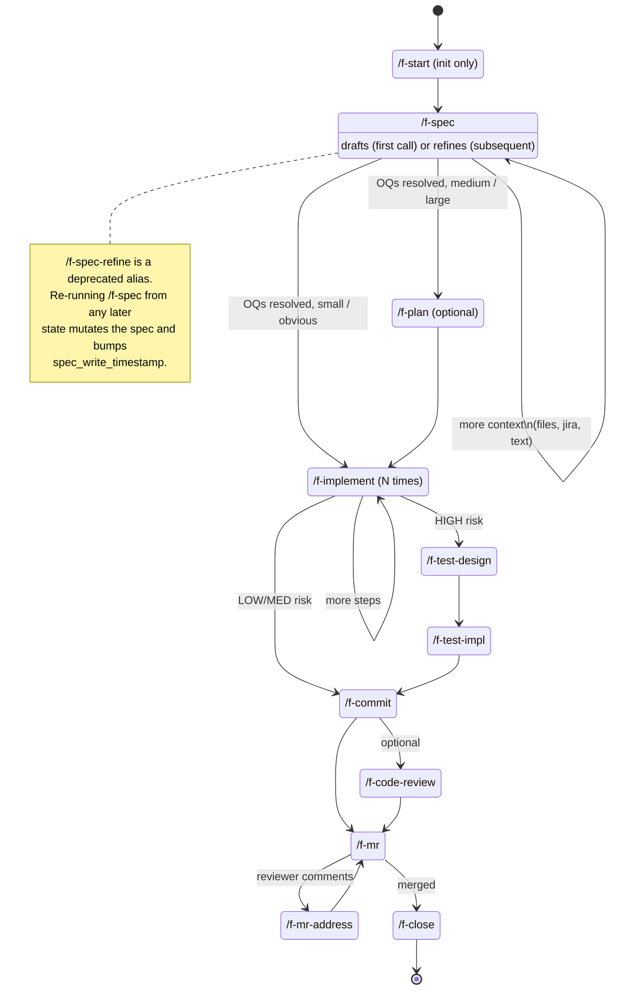
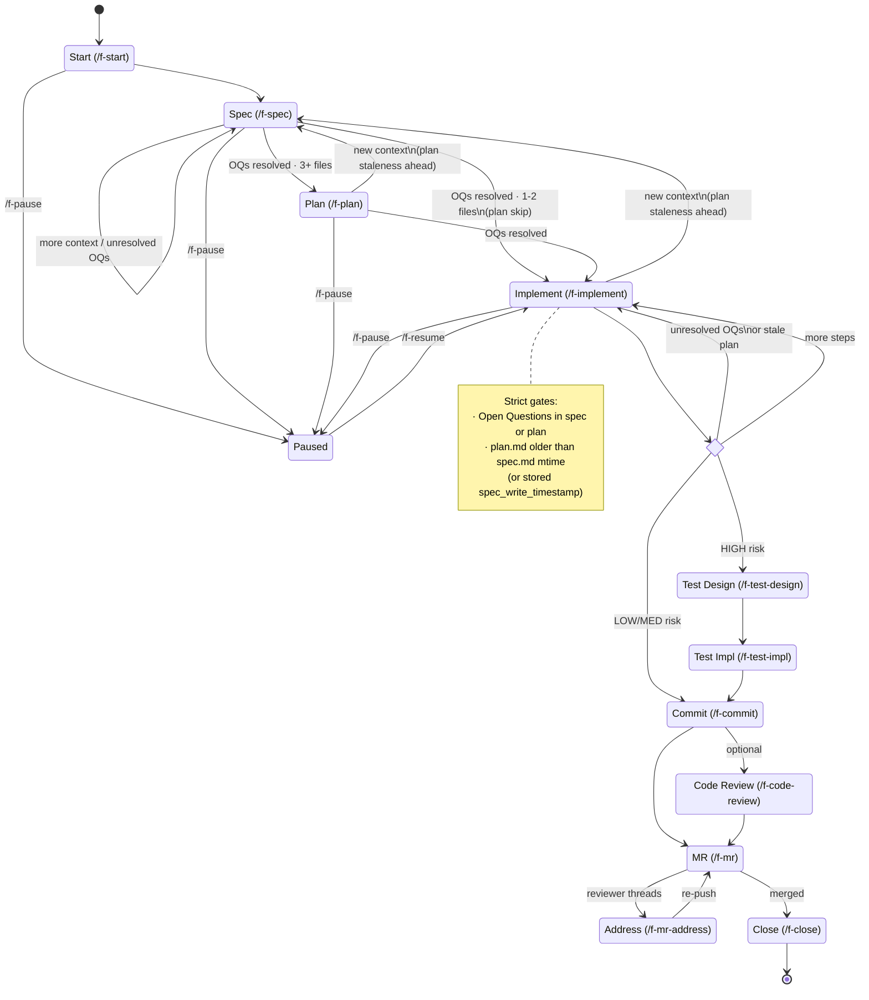
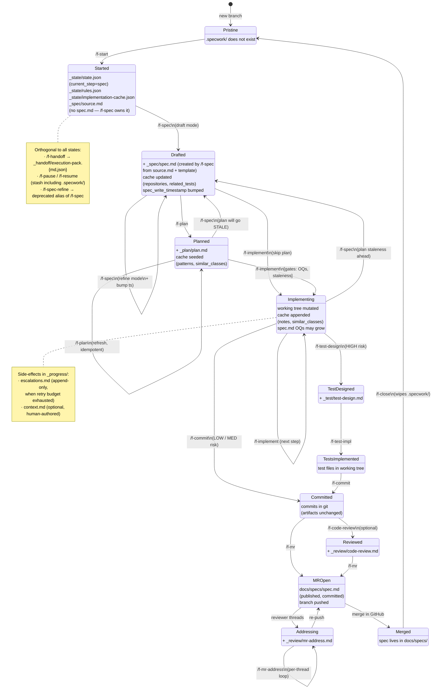

# SDD pipeline — state diagrams

Three views at increasing depth. The diagrams reflect the post-refactor
pipeline where `/f-start` only initializes and `/f-spec` is a separate
idempotent command (drafts the first time, refines after).

Paste any block into GitHub, the Mermaid Live Editor, or any mermaid renderer.

---

## 1. Compact (command flow)

Happy path with optional branches. Best view for a README.

---

## 2. Complete (gates + transversal commands)

Adds the strict gates (`/f-implement`'s OQ + plan-staleness checks), the
`/f-spec` re-entry points from later states, and `/f-pause` / `/f-resume`.

---

## 3. Artifact-oriented

Same pipeline, but each state lists which files live in `.specwork/` at
that point. Transitions are the commands that create / mutate / consume them.

### Reading notes

- Filenames assume the `<slug>-` prefix (omitted for brevity).
- What lives **outside `.specwork/`**: commits, `docs/specs/<slug>-spec.md`
  (published by `/f-mr`), eventually `docs/adr/ADR-NNNN-*.md` if `/doc-adr`
  runs.
- `/f-close` wipes the entire `.specwork/`. It keeps: commits, branch, MR,
  published docs.
- `/f-start` leaves `current_step="spec"` and writes only `source.md` plus
  state files — it does NOT create `spec.md`. `/f-spec` owns `spec.md`:
  draft mode (file missing) creates it; refine mode (file exists)
  integrates new context. `/f-spec` is also the only command that advances
  `spec → plan`, and only on the first draft when all Open Questions are
  resolved.
- The `Planned → Drafted` and `Implementing → Drafted` edges via `/f-spec`
  are the staleness trap: re-running `/f-spec` bumps `spec_write_timestamp`,
  so any existing `plan.md` becomes stale and `/f-implement` will block
  until `/f-plan` re-runs (or the plan is deleted).
